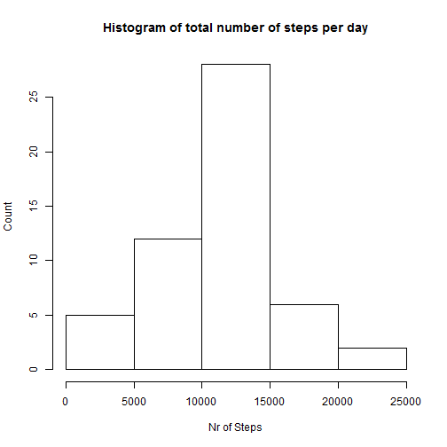
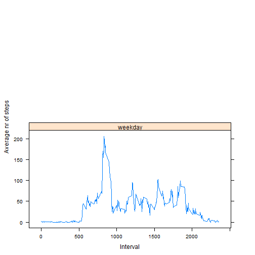

##Introduction  
This page contains the code and output for Course Project 1 on the course "Reproducible Research" given by John Hopkins University via Coursera.

###Loading and preprocessing the data
First we will read the data. This assumes that the data has been downloaded and is in your working directory

```r
raw <- read.csv("activity.csv")
```

Let´s have a quick look at the structure of the data.

```r
str(raw)
```

```
## 'data.frame':	17568 obs. of  3 variables:
##  $ steps   : int  NA NA NA NA NA NA NA NA NA NA ...
##  $ date    : Factor w/ 61 levels "2012-10-01","2012-10-02",..: 1 1 1 1 1 1 1 1 1 1 ...
##  $ interval: int  0 5 10 15 20 25 30 35 40 45 ...
```
We see that the data consists of 17568 observation of three variables.  However, there seems to be lot of NAs in the data for the number of steps taken in each interval. In fact, out of the 17568 observations, 2304 have a value of NA in the steps column. These variables will be kept in the data for now but we will get back to this later.  

Furthermore, we can also see that the date variable is considered a factor. Let´s re-format this do the Date class.

```r
raw$date <- as.Date(raw$date)
```


###What is the mean number of steps taken per day?
This part of the assignment will ignore the missing values in the data set. To analyze the data I will use the tidyverse package by Hadley Wickham. Let´s load tidyverse.

```r
library(tidyverse)
```
The first task is to calculate the total number of steps taken per day. The code below uses the tidyverse package to calculate just that. 

```r
stepsPerDay <- raw %>% group_by(date) %>% summarize(nrSteps = sum(steps))
```
Now let´s plot a histogram of the number of steps taken per day.

```r
hist(stepsPerDay$nrSteps, xlab="Nr of Steps", ylab="Count", main="Histogram of total number of steps per day")
```


  
Choosing a binwidth for a histogram is always a bit tricky. Here I just go with the default from the base plotting system, which gives a decent feeling for how the total number of steps per day is distributed. The mean seems to be somewhere between 10000 and 15000 steps per day. To calculate the actual mean and median we can use the mean() and median() functions in R. Note that we need to tell R to specifically ignore the missing values, if not the function will just return NA.

```r
mean(stepsPerDay$nrSteps, na.rm=TRUE)
```

```
## [1] 10766.19
```

```r
median(stepsPerDay$nrSteps, na.rm=TRUE)
```

```
## [1] 10765
```
As we can see, the mean and median are quite similar with the mean being 10766 steps per day and the median being 10765 steps per day.  

###What is the average daily activity pattern?
To plot the average number of steps taken averaged across all days against the 5-minute interval we need to do some data preparation. The code below calculates the average number of steps in each interval averaged across all days and makes the line plot.

```r
stepsByInterval <- raw %>% group_by(interval) %>% summarize(nrSteps = mean(steps, na.rm=TRUE))

with(stepsByInterval, plot(interval, nrSteps, type="l", col="blue", ylab="Avg number of steps", xlab="Interval", main="Daily Activity Pattern"))
```


  
The next task is to find the 5-minute interval that has the maximum number of average steps across all days in the dataset. Using the code below we see that interval 835 has the highest average number of steps with just over 206 steps. 

```r
filter(stepsByInterval, nrSteps == max(nrSteps))
```

```
## # A tibble: 1 x 2
##   interval  nrSteps
##      <int>    <dbl>
## 1      835 206.1698
```
  
  
###Imputing missing values
As mentioned before, the data contains missing values, coded as NA. First I will calculate the total number of missing values in the data set. The code below will calculate the number of missing values in each column. This will let me know whether several columns contain missing values or of it is only the steps variable that have missing values.

```r
apply(raw, 2, function(x) sum(is.na(x)))
```

```
##    steps     date interval 
##     2304        0        0
```
Only the steps column seem to have missing values. As we saw earlier, the steps variable have 2304 missing values. Since no other column have missing values, the data set will have 2304 rows containing missing values.
  
To impute the missing values I will use the mean for that 5-minute interval. 
These values were calculated when examining the average daily activity pattern and are stored in the stepsByInterval data frame.  
The code below will first join the raw data with the summarized data so that each row will also contain the average number of steps for that particular interval. We will then assign this average value to the step variable for all observations where the current step value is NA. This new data frame will be stored in a new data frame called "processedData".

```r
processedData <- inner_join(raw, stepsByInterval) %>% 
    mutate(steps = ifelse(is.na(steps), nrSteps, steps))
```

```
## Joining, by = "interval"
```
We can now plot a new histogram with the full dataset including the imputed values. First though, we need to calculate the total number of steps per day again, including the imputed values. 

```r
stepsPerDay2 <- processedData %>% group_by(date) %>% 
    summarize(nrSteps = sum(steps))

hist(stepsPerDay2$nrSteps, xlab="Nr of Steps", ylab="Count", main="Histogram of total number of steps per day - Including imputed values")
```


The histogram of the data looks very similar to what it did before imputing values. Let´s look at the mean and median daily number of steps to see how much they have changed as a consequence of the imputed values.

```r
mean(stepsPerDay2$nrSteps, na.rm=TRUE)
```

```
## [1] 10766.19
```

```r
median(stepsPerDay2$nrSteps, na.rm=TRUE)
```

```
## [1] 10766.19
```
The imputed values have not changed the mean or median number of total steps per day much at all. In fact, theu mean is exactly the same as it was before, and lo and behold, after imputing the missing values, the median is actually now the exact same number as well.  

###Are there differences in activity patterns between weekdays and weekends?
The first thing we need to do here is to create a factor variable with two labels - "weekday" and "weekend" to indicate wheter a give ndate is a weekday or a weekend day. To do this, I will first create a variable containing the weekday for each date using the weekdays(). I will then use this variable to create the variable that indicates weekday or weekend day.

```r
processedData$dayOfWeek <- weekdays(processedData$date)
processedData$timeofWeek <- as.factor(ifelse(processedData$dayOfWeek == "lördag" | processedData$dayOfWeek == "söndag", "weekend", "weekday"))
```
  
To make a pretty panel plot we can use the lattice package. Before plotting we need to summarize the data once again. This time we need to calculate the mean number of steps per interval depending on whether the day was a weekday or a weekend day. The code below takes care of the calculation and the plot.


```r
stepsByInterval2 <- processedData %>% group_by(interval, timeofWeek) %>%
    summarize(avgSteps = mean(steps))

library(lattice)
with(stepsByInterval2, 
      xyplot(avgSteps ~ interval|timeofWeek, type="l",
             xlab="Interval",
             ylab="Average nr of steps",
             layout=c(1,2)))
```


  
Looking at the plot we can spot a few differences between the activity on weekends and weekdays. On weekdays there is a clear peak in activity early in the day and then fairly low activity throughout the day. On weekends there is less of a peak. Instead the activity is more evenly spread out through the entire day.
